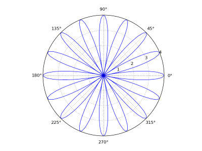

Doing math with Numeric Arrays
===============================

In this chapter, we will see how to plot curves using Numeric arrays and
functions like *plot* and *polar*.

Plotting a sine curve
----------------------

Say you wish to plot one full cycle of the sine curve. The first step is to
generate a set of numbers between 0 and 2*pi. This can be done very easily
using a function called *linspace*::

   >>> from pylab import *
   >>> a = linspace(0, 2*pi, 4)
   >>>> a
   array([ 0.        ,  2.0943951 ,  4.1887902 ,  6.28318531])
   >>> sin(a)
   array([  0.00000000e+00,   8.66025404e-01,  -8.66025404e-01,
        -2.44921271e-16])
   >>>

The function::

   linspace(x, y, N)

generates N equally spaced numbers starting from *x* and ending in *y*; the 
difference between adjacent numbers is fixed. In the above case, *x* is 0, *y* is 6.28
and *N* is 4. The output which *linspace* generates is a Numeric Array:

    array([0,  2.0943951 , 4.1887902, 6.28318531])

You observe that the difference between consecutive numbers is fixed, approximately
equal to 2.09. When you apply the *sin* function on *a*, it computes sine of *all* the
numbers in the numeric sequence.

Plotting a sine curve with just 4 points is not a good idea; especially when it is so
easy to generate any number of points::

   >>> x = linspace(0, 2*pi, 200)
   >>> y = sin(x)
   >>> plot(x, y)
   [<matplotlib.lines.Line2D object at 0x9bf4bac>]
   >>> show()
   >>>

Now, we are generating 200 points (in *x*) and storing the *sin* of each of these
points in *y*. The *plot* function works like this: it takes the first number in *x*
and the first number in *y* and plots a point, then it takes the second number in *x*
and the second number in *y* and plots another point ... and so on. Note that when you
apply *plot*, it does not immediately show you the graph - it just prints a line in the
output (we need not understand what that line means). Only when the *show* function is
applied do we actually get the plot on the screen!

.. image:: ../images/sine2.png

Plotting the polar rose
------------------------

In mathematics, the polar coordinate system is a two-dimensional coordinate system
in which each point in a plane is determined by a pair of values:

.. math::
   (r, \theta)

where *r* represents the distance from a fixed point (called the *pole*) and *theta* 
represents an angle with respect to a fixed direction.

It is easy to plot in polar coordinates, as the following example illustrates.

The *polar rose* is defined as:

.. math::

  r(\theta) = acos({k\theta})

We get a k-petalled rose if *k* is odd and *2k* petalled rose if *k* is even. Here is a
Python code fragment which plots the polar rose::

   >>> from pylab import *
   >>> theta = linspace(0, 2*pi, 200)
   >>> r = 4 * cos(8 * theta)
   >>> polar(theta, r)
   [<matplotlib.lines.Line2D object at 0xa3efb4c>]
   >>> show()
   >>>

The function *polar* works with two numeric arrays - the second one gives the *r* values of each
point in the plane and the first one gives the corresponding angles. Here is the plot:

Exercises
----------
   1) Refer your maths textbook and find out the polar equation of the curve called a *cardiod*. Try
      to plot the *cardiod* using Python.

   2) Try to plot a circle in polar coordinates.

